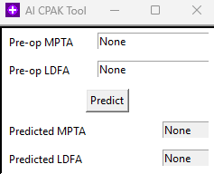

# NYU Langone Medical Center Knee Alignment Research

@author Jack Bosco

---

## NEW: Mobile Site [LINK](https://cd23g723swvsaiowa6kmu6fn3u0xzmne.lambda-url.us-east-1.on.aws/)

## What is the Goal?

Using machine learning techniques such as feature selection and data clustering, we hope to develop our understanding of knee alignment morphologies.

## How do I use this?



If you just want to launch the graphical user interface (GUI), follow the 3-step guide below. Requires `python3.10`+.

1. `clone` and `cd` to the project directory
   ```
   git clone https://github.com/JackBosco/AI_CPAK/ && cd AI_CPAK
   ```
2. Make sure you have the right dependencies by running the command below. You only need to do this once.
   ```
   pip3 install -r requirements.txt
   ```
3. Launch the GUI
   ```
   python3 gui.py
   ```

## Where is the data?

Due to compliance reasons, I cannot upload the datasheet to GitHub.
However, if you have the `mako_data.xlsx` file, drop that in `raw`.

### I have my own data. How do I reproduce the paper?

1. `clone` and `cd` to the project directory
   ```
   git clone https://github.com/JackBosco/AI_CPAK/ && cd AI_CPAK
   ```
2. Make sure you have the right dependencies by running the command below. You only need to do this once.
   ```
   pip3 install -r requirements.txt
   ```
3. To treat the data, run the command below. This creates the treated spreadsheet `treated/morphologies.csv`. You only need to run this once.
   ```
   python3 treat_data.py
   ```
4. Visualize the treated data by running
   ```
   python3 data_viz.py
   ```
<!-- 5. Create a data clustering example (optional command line options are `nclusters <int>`, `bmi`, `age`, `FTR` for femoral transverse rotation, `sex`):
   ```
   python3 make_clusters.py
   ``` -->
5. Create and visualize a regression model for planning postop aHKA alignments
   ```
   python3 regression.py
   ```

### Config options

Configure the date file locations in `config.py`:
 - `raw_path` is the path to the raw data
 - `treated_path` is the path to the treated data
 - `norm_path` is the path to the input normalizer
 - `de_norm_path` is the path to the output normalizer
 - `model_path` is the path to the pre-trained model

## `gui.py` is the only file that will run if you don't supply the de-anonymized patient data yourself
I cannot privide the files in this repo due to compliance reasons, but please reach out to me if you would like to run this on your own dataset.

linkedin: [linkedin.com/in/JackBosco](https://linkedin.com/in/JackBosco).
